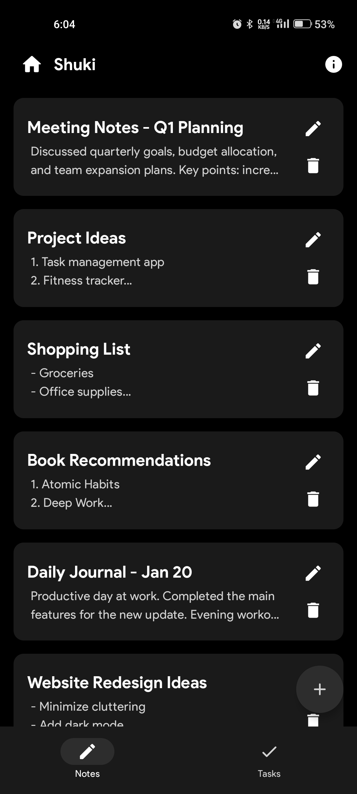
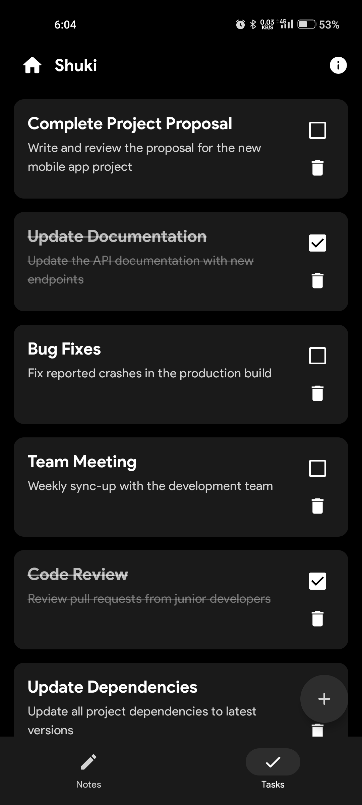

# 📝 Shuki - Your Personal Notes & Tasks Organizer

Welcome to **Shuki**, a sleek and intuitive app designed to help you capture ideas, manage tasks, and stay organized effortlessly. Whether it's jotting down quick notes or tracking your daily to-do lists, Shuki empowers you to take control of your productivity with simplicity and elegance.

---

## ✨ Features

- **Quick Notes**: Capture your thoughts instantly with a clean, distraction-free editor.
- **Task Management**: Create and manage your daily tasks with ease.
- **Organized Views**: Easily switch between notes and tasks for focused productivity.
- **Minimalistic UI**: Built with Jetpack Compose for a modern and responsive design.
- **Lightweight & Fast**: Smooth performance for a seamless user experience.

---

## 🎨 UI Highlights

- **Modern Design**: Clean layouts, soft typography, and a calming color palette.
- **Dynamic Layouts**:
  - A **Notes Screen** for jotting down thoughts.
  - A **Tasks Screen** for managing to-dos.
- **Effortless Navigation**: Easily switch between sections with bottom navigation.

---

## 🚀 Technologies Used

- **Language**: Kotlin  
- **UI Framework**: Jetpack Compose  
- **Architecture**: Simple state management following Compose best practices  
- **Persistence**: Room Database (or local storage, depending on your design)

---

## 📸 Screenshots

<div align="center">
  




<br/><br/>


</div>

---

## 🛠️ Setup & Installation

1. **Clone the Repository**:
   ```bash
   git clone https://github.com/MohammadAliUstad/Shuki.git
   cd shuki
   ```
2. **Open in Android Studio**: Import the project and sync Gradle.  
3. **Run**: Build and run the app on an emulator or physical device.

---

## 🌟 Contributing

Contributions are welcome!  
Feel free to fork the repository, make enhancements, and open a pull request to improve Shuki together.

---

## 📞 Contact

Got feedback, ideas, or just want to say hello? Reach out to me:  
📧 **Mohammadaliustad@gmail.com**

---

**Made with ❤️ to boost your productivity by Yugen Tech**

---
